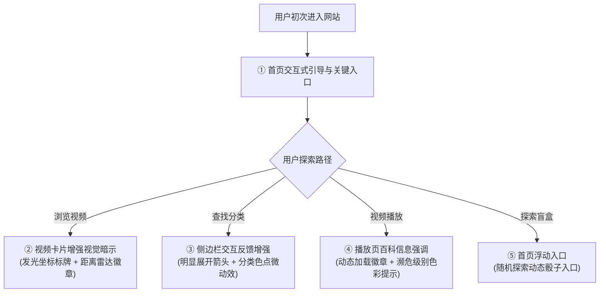

# 🐾 AnimalVerse — 核心功能清单与用户测试指南
> **文档版本**: v1.0 | **项目阶段**: FYP 1 | **对应系统**: AnimalVerse 野生动物互动流媒体与生态探索平台

---

## 目录
1. [项目定位与核心价值](#1-项目定位与核心价值)
2. [系统核心功能清单 (Feature Specification)](#2-系统核心功能清单-feature-specification)
3. [针对用户测试反馈的诊断与修复方案](#3-针对用户测试反馈的诊断与修复方案)
   - 3.1 [字迹不统一问题分析与修复策略](#31-字迹不统一问题分析与修复策略)
   - 3.2 [功能引导与 UI 暗示不足的原因剖析](#32-功能引导与-ui-暗示不足的原因剖析)
   - 3.3 [UI 视觉暗示与引导增强方案 (Signifiers & Affordance)](#33-ui-视觉暗示与引导增强方案)
4. [第一轮用户可用性测试任务清单 (Usability Test Tasks)](#4-第一轮用户可用性测试任务清单-usability-test-tasks)
5. [引导增强实现日志与代码索引 (Implementation Log)](#5-引导增强实现日志与代码索引-implementation-log)
   - 5.1 [视频卡片：可点击坐标 + 距离雷达徽章](#51-视频卡片可点击坐标--距离雷达徽章)
   - 5.2 [主页：3 个快捷功能导航卡](#52-主页3-个快捷功能导航卡)
   - 5.3 [首页：Random Video 盲盒浮动入口](#53-首页random-video-盲盒浮动入口)
   - 5.4 [全站：首次访问 3 步引导气泡](#54-全站首次访问-3-步引导气泡)
   - 5.5 [播放页：IUCN 彩色药丸徽章](#55-播放页iucn-彩色药丸徽章)
   - 5.6 [附带修复：playback.html 残留错误文本](#56-附带修复playbackhtml-残留错误文本)
6. [前端二次优化的快速定位指引 (Code Map)](#6-前端二次优化的快速定位指引-code-map)

---

## 1. 项目定位与核心价值

**AnimalVerse** 是一款专为野生动物爱好者、学生与自然科学学习者设计的**互动式野生动物流媒体与地理探索平台**。

传统流媒体平台（如 YouTube/Bilibili）的痛点在于：**“看视频只是看视频，缺乏物种科学关联与地理空间感知”**。AnimalVerse 的核心创新与主要价值体现在：

1. **视频 + 地理空间联动 (GIS Location Radar)**：每个动物视频均绑定精准 GPS 坐标，支持用户通过交互式世界地图按拍摄地探索动物，并支持基于用户真实位置的 **“你身边的动物”** 距离计算与推荐。
2. **视频 + 即时生物百科 (Live Species Encyclopedia)**：播放视频时，系统自动联动 Wikipedia、Wikidata、GBIF 与本地科学数据库，动态呈现该物种的学名、保护级别（IUCN Red List）、栖息地习性与精选冷知识。
3. **多维分类与趣味探索 (Multi-dimensional Discovery)**：打破单一关键词搜索，支持生物纲目分类（哺乳纲、鸟纲、爬行纲等）、生态标签过滤与**随机视频盲盒（Random Video Picker）**探索。
4. **复古像素与现代化沉浸美学 (Retro-Pixel Theme)**：独具特色的像素风 HUD 界面与音效反馈，兼具探索趣味性与信息高效性。

---

## 2. 系统核心功能清单 (Feature Specification)

| 模块序号 | 功能模块 | 对应页面/路径 | 核心功能点描述 | 用户预期交互与效果 |
| :--- | :--- | :--- | :--- | :--- |
| **F01** | **主页全景与智能推荐** | `home.html` | ① Hero Banner 视觉引导与探索入口<br>② 基于当前用户 GPS 距离的 **“Animals Near You (附近动物)”** 智能排序与推荐<br>③ 热门与精选视频推荐流<br>④ 物种纲目快速分类导航条 | 用户打开首页即可一览热门内容，并根据自身定位发现距离最近的野生动物视频。 |
| **F02** | **全球动物交互式地图** | `map.html` | ① 基于 Leaflet.js 的世界地图，点位聚合展示全球野生动物视频分布<br>② 实时对接 **iNaturalist API**，动态渲染全球野生动物观察真实数据点<br>③ 点击标记点弹出物种卡片，支持直达播放与距离计算 | 用户可在地图上自由拖拽缩放，按大洲与经纬度探索物种，直观建立地理生态认知。 |
| **F03** | **视频库多维筛选与检索** | `gallery.html`<br>`search.html` | ① **纲目分类过滤**（Mammals, Birds, Reptiles, Aquatic, Fish, Invertebrates, Themed）<br>② **生态标签过滤**（夜行/昼行、食性、陆生/水生等）<br>③ **复合排序**（最新发布、最受喜爱、时长、名称等）<br>④ **即时全文字符搜索**与高亮匹配 | 用户可通过多级筛选器精准定位特定生态特征的动物视频，并支持无刷新分页/瀑布流加载。 |
| **F04** | **全功能沉浸播放与实时百科** | `playback.html` | ① YouTube 播放器集成与响应式布局<br>② **实时物种百科抽屉**：动态调取 Wikipedia/GBIF 获取保护级别与学名<br>③ **拍摄地地理雷达 (Location Mini-Map)**：标注视频拍摄地并显示与用户的直线距离<br>④ **精选物种冷知识 (Animal Facts)**<br>⑤ 相关物种视频推荐列表 | 用户边看视频边获取权威生态学数据，将流媒体观看转化为深度科普体验。 |
| **F05** | **随机动物视频盲盒** | `random_vid.html` | ① 蜂巢六边形矩阵 / 随机动物挑选交互<br>② 像素复古 HUD 探索界面与音效反馈<br>③ 一键刷新与盲盒惊喜机制 | 解决用户“不知道看什么”的痛点，通过趣味随机交互增加长尾小众物种的曝光率。 |
| **F06** | **个人图书馆与历史足迹** | `favorites.html`<br>`liked_vid.html`<br>`view_history.html` | ① 视频一键收藏 (Favorites) 与稍后观看 (Watch Later)<br>② 点赞视频聚合记录 (Liked Videos)<br>③ 播放历史记录与断点进度 (View History)<br>④ 基于 localStorage 的数据离线持久化 | 用户随时回看自己感兴趣的动物视频，个人偏好数据本地存储且无需强制注册。 |
| **F07** | **数据洞察与生态统计仪表盘** | `dashboard.html`<br>`statistics.html` | ① 平台物种纲目分布统计图表<br>② 个人观看偏好分布（最常看的动物纲目占比）<br>③ 探索足迹里程数统计 | 直观展示用户的探索历程与全站动物视频的生物多样性数据。 |
| **F08** | **AI 生态探索向导 (规划/原型)** | 悬浮 Chatbot 抽屉 (`chatbot.html`) | ① 悬浮呼出智能问答助手<br>② 辅助用户按物种特征提问推荐视频（FYP2 Bedrock / Lex 后续对接） | 引导用户通过自然语言寻找特定习性或形态的动物。 |
| **F09** | **双主题与复古像素 UI 系统** | 全站主题切换器 (`theme.js`) | ① 深色模式 / 浅色模式自由切换<br>② Retro Pixel（复古像素风格）沉浸式视觉系统与音效 | 满足不同光线环境下的阅读需求，提供游戏化与复古风格的探索体验。 |

---

## 3. 针对用户测试反馈的诊断与修复方案

### 3.1 字迹不统一问题分析与修复策略
* **问题现象**：在侧边栏（Sidebar）中，主菜单项（如 `Categories`）使用了复古像素字体（`Pixelify Sans`），但下拉展开后的二级子菜单项（`Mammals`, `Birds`, `Reptiles` 等）使用了标准无衬线字体（`Inter`），导致同模块字体割裂。
* **原因排查**：在 `theme-pixel.css` 中只定义了 `.theme-pixel .sidebar__link` 的字体，遗漏了 `.theme-pixel .sidebar__sub-link` 的字体覆盖。
* **修复措施（已执行代码修复）**：
  在 `animal-verse/css/base/theme-pixel.css` 中补充定义：
  ```css
  .theme-pixel .sidebar__sub-link {
    font-family: var(--ff-pixel) !important;
    font-weight: var(--fw-bold) !important;
    border-radius: 0px !important;
    transition: all var(--transition-fast) !important;
  }
  .theme-pixel .sidebar__sub-link:hover {
    background: var(--clr-accent) !important;
    color: var(--clr-primary) !important;
  }
  ```
* **全局排版规范统一原则**：
  1. **像素主题 (`.theme-pixel`)**：所有操作按钮、标题、导航链接、标签及徽章一律使用 `var(--ff-pixel)`；
  2. **正文字段**：长篇百科描述段落为了保证可读性使用 `var(--ff-body)`（Inter），技术数据（坐标、距离、时间）使用 `var(--ff-mono)`（JetBrains Mono）；
  3. **层级一致**：同级菜单与子菜单绝不混用不同字系。

---

### 3.2 功能引导与 UI 暗示不足的原因剖析
用户反馈指出了非常关键的用户体验问题：**“如果第一次测试有功能一直没被发现，就是功能引导不好或者UI暗示没给够”**。

经过全站交互动线复盘，以下 4 个高价值功能最容易因“暗示不足”被用户漏测：

| 易被遗漏的功能 | 用户漏测的根本原因 (Root Cause) | 缺乏的 UI 暗示 (Missing Affordance) |
| :--- | :--- | :--- |
| **1. 视频与地图的联动 (GIS Radar)** | 用户以为视频卡片只是普通的缩略图，不知道点击坐标能联动地图。 | 卡片上的地理坐标缺少“可点击”视觉指示（如小手光标、下划线微动效、雷达扫描动效）。 |
| **2. 播放页的即时物种百科 (Species Facts & Wiki)** | 百科信息位于右侧/下方，视频播放时用户视线被视频吸引，未注意到右侧数据是动态从 Wiki 调取的。 | 缺少醒目的“🐾 查看该物种权威百科与保护等级”的标签高亮提示或微动画。 |
| **3. 侧边栏的分类下拉菜单** | `Categories` 右侧的小箭头（Chevron）较小，用户以为它是一个单页链接而非可展开的手风琴菜单。 | 展开箭头指示缺乏明显的 Hover 旋转动效与“可折叠/展开”视觉反馈。 |
| **4. 随机视频盲盒 (Random Video)** | 入口仅位于侧边栏底部，容易在首屏之外被忽视。 | 主页缺少醒目的“🎲 随机发现 / 盲盒探索”快速浮动卡片。 |

---

### 3.3 UI 视觉暗示与引导增强方案 (Signifiers & Affordance)

为了确保用户在首次使用时即可自然探索全部功能，建议在 UI 上部署以下 4 项增强策略：



1. **增强视觉暗示 (Visual Signifiers)**：
   - **地理坐标卡片**：在每个视频卡片下方添加小雷达图标 `📍 1,240 km away`，鼠标悬停时显示 Tooltip：*“点击在世界地图中定位此动物”*。
   - **分类下拉菜单**：为 `Categories` 菜单项添加轻微的背景渐变高亮与悬停提示文字，展开时箭头平滑旋转 90 度并伴随展开音效/微动效。
   - **百科知识卡片**：在 `playback.html` 的百科知识区域顶部加入 IUCN 濒危状态彩色药丸徽章（如 `🔴 CR Critically Endangered`），吸引用户阅读。

2. **增加首次访问引导气泡 (Feature Onboarding Tooltips)**：
   - 当用户首次进入页面时，提供一个可一键关闭（或点击“开始探索”）的简短 3 步指南：
     - *Step 1: 全球地图探索 — 按经纬度发现野生动物*
     - *Step 2: 动态百科联动 — 边看视频边学动物科学知识*
     - *Step 3: 盲盒随机发现 — 摇一摇发现神秘野生动物*

3. **主页增设快捷功能导航卡 (Hero Feature Highlights)**：
   - 在首页 Hero 下方增加 3 个高对比度的快速探索卡片：
     - 🗺️ **[探索全球动物地图]**
     - 🎲 **[开启随机动物盲盒]**
     - 📍 **[查看我身边的动物]**

---

## 4. 第一轮用户可用性测试任务清单 (Usability Test Tasks)

为测试人员提供以下 **8 项端到端用户测试场景 (Test Scenarios)**，用于客观评估系统的功能完备度与交互流畅度：

- [ ] **任务 1（地理定位感知）**：打开首页，找到 **“Animals Near You (附近动物)”** 区域，查看距离自己最近的动物视频是哪一只。
- [ ] **任务 2（分类展开与筛选）**：打开左侧导航栏，展开 **`Categories`** 菜单，进入 **`Birds` (鸟纲)** 分类并确认页面字体风格与视觉统一性。
- [ ] **任务 3（全球地图探索）**：点击导航栏中的 **`Animal Map`**，在地图上缩放寻找非洲大陆的动物点位，点击任意一个点位并预览弹出卡片。
- [ ] **任务 4（深度视频与百科联动）**：从地图或列表进入任意视频播放页 (`playback.html`)，确认视频能否正常播放，并阅读右侧/下方的 **Wikipedia 学名** 与 **IUCN 保护状态**。
- [ ] **任务 5（随机盲盒探索）**：点击侧边栏底部的 **`Random Video`**，触发一次随机动物推荐，观察是否获得惊喜视频。
- [ ] **任务 6（收藏与稍后观看）**：在视频卡片或播放页点击 **“⭐ Favorite”** 收藏该视频，然后进入 **`Favorites`** 页面确认视频是否已正确保存。
- [ ] **任务 7（主题切换与自适应）**：点击顶部导航栏的主题切换按钮，在 **浅色模式** 与 **深色模式** 之间切换，检查文字与背景对比度是否清晰。
- [ ] **任务 8（多维检索）**：在顶部搜索框中输入特定动物名称（如 `"Lion"` 或 `"Penguin"`），验证搜索结果是否即时高亮呈现。

---

> 💡 **附注**：本清单已同步作为工程测试标准。如测试过程中发现任何未被自然引导的操作步骤，可直接记录在测试反馈表中供下一轮迭代优化。

---

## 5. 引导增强实现日志与代码索引 (Implementation Log)

> 本节把第 3.3 节的"增强方案"逐条落到代码，标注**改了哪些文件、核心实现在哪、如何验证**。后续前端优化请先对照本节的代码索引，避免改动时踩到已实现的逻辑。

### 5.1 视频卡片：可点击坐标 + 距离雷达徽章
* **对应方案**：3.3-①（地理坐标卡片增强视觉暗示）
* **涉及文件**：
  - `js/ui.js` → `_buildLocationBar(video)` + `createVideoCard()`：在每张卡片底部渲染位置条（雷达点 + 地点名 + 距离），整条是可点击链接，指向 `map.html?focus=lat,lng&name=...`。
  - `js/map.js` → `getFocusFromUrl()` / `applyFocusFromUrl()`：解析 `?focus=` 深链，自动平移到该拍摄点并打开最近的视频点位弹窗（找不到本地点位则放一个临时红色焦点标记）。
  - `js/utils.js` → 新增 `formatDistance(km)`、`setUserPosition(lat,lng)`、`getUserPosition()`。
  - `js/home.js` → 定位成功回调里调用 `App.utils.setUserPosition(lat, lng)`。
  - `css/components/video-card.css` → `.video-card__location*` 与雷达脉冲 `@keyframes radar-ping`（含暗色/减弱动效适配）。
* **关键设计**：**绝不主动弹定位授权**。用户坐标只在首页 "Animals Near You" 授权后通过 `setUserPosition` 共享给全站；未授权时卡片只显示"雷达点 + 地点名"（仍可点击进地图），距离文本留空。
* **数据前提**：`data/videos.json` 中每条视频均有 `location: { name, lat, lng, region }`（423/423）。

### 5.2 主页：3 个快捷功能导航卡
* **对应方案**：3.3-③（主页增设快捷功能导航卡）
* **涉及文件**：
  - `home.html` → 在 Hero 结束后、`#article-main` 之前新增 `<section class="quick-nav" id="quick-nav">`，含 3 张高对比卡片：🗺️ Explore the Map → `map.html`；🎲 Random Discovery → `random_vid.html`；📍 Animals Near You → 锚点 `#nearby-section`。
  - `css/pages/home.css` → `.quick-nav*` 样式（深色横带、像素描边、hover 位移、移动端单列）。
* **注意**：原 "Why Animal-Verse?" Bento Grid（Discover/Learn/Contribute）是**营销卡，未被替换**；快捷导航是独立新增区段。

### 5.3 首页：Random Video 盲盒浮动入口
* **对应方案**：3.2-4（Random Video 入口易被漏测）
* **涉及文件**：
  - `home.html` → 在 `data-include="chatbot"` 之后新增 `<a class="random-fab" href="random_vid.html">`（🎲 Random Discovery 悬浮胶囊）。
  - `css/pages/home.css` → `.random-fab*`（右下角 fixed，`bottom:176px` 避开 chatbot 启动按钮；移动端 `bottom:110px` 且只显示图标；上下浮动 + 骰子摆动动画）。
* **注意**：FAB 与右下角 chatbot 的定位已错开；若调整 chatbot 高度请同步改 `.random-fab` 的 `bottom` 值。

### 5.4 全站：首次访问 3 步引导气泡
* **对应方案**：3.3-②（首次访问引导气泡）
* **涉及文件**：
  - `js/onboarding.js`（**新增**）→ `App.onboarding` 模块：读取 `localStorage['animalverse-onboarded']`，首次访问时延迟 1.2s 弹出 3 步引导（地图 / 百科 / 盲盒），支持 下一步/上一步/跳过/背景点击/Esc/方向键；最后一步按钮变为 "Start Exploring"，点击后写入 localStorage 不再出现。
  - `css/components/onboarding.css`（**新增**）→ 复古像素对话框样式 + 暗色/减弱动效适配。
  - `css/main.css` → `@import url('components/onboarding.css');`。
  - `js/app.js` → 共享初始化区新增 `App.onboarding.init();`。
  - **全部 17 个 HTML 页面** → 在 `js/app.js` 之前插入 `<script defer src="js/onboarding.js"></script>`（defer 按文档顺序执行，必须在 app.js 前）。
* **调试提示**：想反复看引导，先在 DevTools 里删掉 `animalverse-onboarded` 再刷新。

### 5.5 播放页：IUCN 彩色药丸徽章
* **对应方案**：3.3-① 第 3 点（百科知识卡片 IUCN 状态彩色药丸）
* **涉及文件**：
  - `js/animal-info.js` → 抽出共享映射 `CONSERVATION_STATUSES`（按"严重程度从高到低"排序，首个命中的等级获胜）与 `getConservationInfo(status)`；新增 `buildConservationPill(status)` 返回 `<span class="conservation-pill conservation-pill--cr">…</span>`；`formatConservationStatus` 改为复用该映射（向后兼容，输出不变）。
  - `js/player-animal.js` → 新增 `renderConservationPill(result)` + `setConservationPill(container, status)`，在 `fetchAll` 成功后调用；**状态来源优先级：Wikidata → iNaturalist → 本地 `data/animal-facts.json`**。
  - `playback.html` → 在 Tab 行与卡片之间新增 `<div class="animal-info__conservation-pill" id="animal-conservation-pill">`。
  - `css/pages/playback.css` → `.conservation-pill*` 与 **9 个色阶类**（`--lc/--nt/--vu/--en/--cr/--ew/--ex/--dd/--ne`）+ 暗色适配。
* **关键设计（本地兜底）**：Wikidata/iNaturalist 是实时 API，很多物种拿不到状态，导致 pill 不显示、难以演示。因此加了**本地兜底**——`data/animal-facts.json` 的 `species` 表里 26 个物种全部带 `conservationStatus` 字段，直接复用。
* **状态值解析**：`getConservationInfo` 用"关键词扫描 + 取最严重"策略，能解析带修饰语的字符串：
  - `Endangered (African), Endangered (Asian)` → `Endangered`
  - `Vulnerable to Critically Endangered (species dependent)` → `Critically Endangered`（取更严重者）
  - `Not Evaluated (most species)` / `Data Deficient` → 灰色 `--ne` / `--dd`
  - `LC` / `CR` 等缩写也支持；无法识别的值不显示 pill（优雅隐藏）。

### 5.6 附带修复：playback.html 残留错误文本
* **问题**：`playback.html` 内 "Filming Location" 上方残留了两行裸文本 `Diagnostic Note: / Error parsing Wikipedia response: Cannot read properties of undefined (reading 'length')`，会真实渲染到页面。
* **处置**：已删除。经排查，该报错源于早期版本 `analyzeWikipediaText` 的 `.length` 边界问题，当前代码（`js/animal-info.js` + `js/player-animal.js` 的渲染侧）均已加防护，实测不再触发。

---

## 6. 前端二次优化的快速定位指引 (Code Map)

| 想改的东西 | 去哪里改 |
| :--- | :--- |
| 视频卡片的距离/坐标显示样式 | `css/components/video-card.css`（`.video-card__location*`、`radar-ping`） |
| 卡片距离计算的逻辑 | `js/ui.js` `_buildLocationBar()` + `js/utils.js`（`getDistance`/`formatDistance`/`getUserPosition`） |
| 地图深链定位行为 | `js/map.js` `applyFocusFromUrl()`（匹配阈值、zoom、焦点标记） |
| 首页快捷导航卡的文案/链接 | `home.html` `#quick-nav` 区段 + `css/pages/home.css` |
| 首页 Random 悬浮按钮位置/动画 | `home.html` `.random-fab` + `css/pages/home.css` |
| 首次引导的步骤内容 | `js/onboarding.js` 顶部 `STEPS` 数组（改文案/加步骤） |
| 首次引导的样式 | `css/components/onboarding.css` |
| IUCN 状态 → 颜色的映射 | `js/animal-info.js` `CONSERVATION_STATUSES` |
| IUCN 药丸徽章的颜色/样式 | `css/pages/playback.css`（`.conservation-pill--*`） |
| IUCN 徽章展示位置 | `playback.html` `#animal-conservation-pill` + `js/player-animal.js` `renderConservationPill()` |
